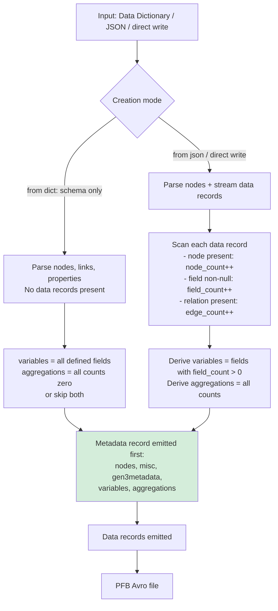
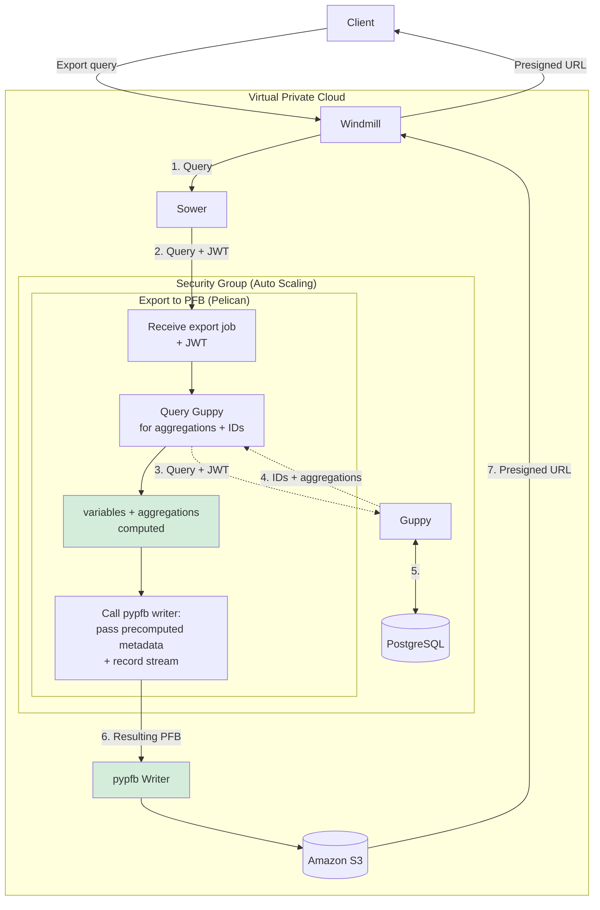

# pypfb Variables & Aggregations — Design Proposal

## Summary

A PFB file today captures a data model and data records, but carries no summary of *which fields actually contain data* or *how many records exist per node*. This matters for data discovery: a consumer receiving a PFB cannot quickly answer "does this file have `age` values?" or "how many `demographic` records are linked to `case` records?" without scanning every row.

This proposal adds two metadata fields to the PFB `Metadata` record — **`variables`** and **`aggregations`** — that are computed at creation time and can be queried instantaneously without reading data rows. Both are already implemented on the `feat/gen3metadata-poc` branch as nullable fields.

---

## 1. Variables

### Purpose

List every `<node>.<field>` pair that has at least one non-null value present in the dataset. Allows a consumer to quickly know what data is populated without scanning records.

### Format

A flat array of dot-notation strings: `"<node>.<field>"`. Using dot notation disambiguates fields that share names across nodes (e.g., `submitter_id` exists on every Gen3 node).

**Avro type (current PoC to account for both ints and floats):** `union<null, array<string>>`

### Example

Variable selection from 1000 Genomes:

```json
[
  "demographic.annotated_sex",
  "demographic.population",
  "demographic.submitter_id",
  "sample.specimen_id",
  "sample.submitter_id",
  "subject.consent_codes",
  "subject.participant_id",
  "subject.submitter_id",
  "study.study_id",
  "study.study_description"
]
```

### Pseudo JSON Schema

```jsonc
// variables: array of "<node>.<field>" strings
{
  "type": "array",
  "items": {
    "type": "string",
    "pattern": "^[a-zA-Z_][a-zA-Z0-9_]*\\.[a-zA-Z_][a-zA-Z0-9_]*$",
    "description": "<node_name>.<field_name> — only fields with ≥1 non-null value"
  },
  "uniqueItems": true
}
```

---

## 2. Aggregations

### Purpose

Provide count-based summary statistics at three granularities:

| Key pattern | Meaning |
|---|---|
| `<node>` | Total number of records for that node type |
| `<node>.<field>` | Count of non-null values for that field across all records |
| `<node>-><related_node>` | Count of edges (relations) between two node types |

The arrow key for edge counts is particularly useful for many-to-one / many-to-many relationships: it tells a consumer how many links exist without walking the full graph.

**Avro type (current PoC):** `union<null, map<union<null, long, double>>>`

The map value is `long` for integer counts and `double` for future ratio/percentage statistics.

### Example

Selection from 1000 Genomes (3,202 subjects):

```json
{
  "demographic": 3202,
  "sample": 3202,
  "study": 1,
  "subject": 3202,
  "demographic.annotated_sex": 3202,
  "demographic.population": 3202,
  "demographic.submitter_id": 3202,
  "sample.specimen_id": 3202,
  "sample.submitter_id": 3202,
  "subject.consent_codes": 3202,
  "subject.participant_id": 3202,
  "subject.submitter_id": 3202,
  "demographic->subject": 3202,
  "sample->subject": 3202,
  "subject->study": 3202
}
```

### Pseudo JSON Schema

```jsonc
// aggregations: flat map with documented key conventions
{
  "type": "object",
  "description": "Keys: '<node>' = record count, '<node>.<field>' = non-null value count, '<node>-><node>' = edge count",
  "additionalProperties": {
    "type": ["null", "integer", "number"]
  },
  "examples": {
    "demographic": 1248,
    "demographic.gender": 1240,
    "demographic->case": 1248
  }
}
```

---

## 3. PFB Creation Flow



**Key design decision:** variables and aggregations require a data scan, which means they are computed *before* writing starts (two-pass) or accumulated during a single streaming pass and written to the header at close time. Avro's write-once header makes the two-pass approach simplest; the writer buffers aggregation state in memory then emits the Metadata record first.

**Skip option:** For schema-only PFBs (e.g., `pfb from dict`) or when the data owner prefers to omit summary stats, a `--skip-variables` / `--skip-aggregations` flag on the creation command leaves these fields `null`.

---

## 4. Pelican Integration Flow

Pelican is the most common path for PFB creation in production. Because Avro headers are written first but aggregations require a full data scan, Pelican needs to compute variables and aggregations *before* calling the pypfb writer. Pelican queries Guppy to retrieve both the matching record IDs and aggregation counts, then passes the pre-computed metadata directly to the pypfb writer alongside the record stream. No in-memory buffering of records is required.



**Key integration point:** pypfb needs a way to accept pre-computed variables and aggregations at writer construction time so Pelican can pass DB-derived counts without triggering a second pass. The existing `pfb update` command covers the post-hoc case; a writer-level API (e.g., `PFBWriter(variables=..., aggregations=...)`) is the cleanest path for Pelican.

---

## 5. CLI Surface

### Current PoC (implemented)

```sh
# Read variables from an existing PFB
pfb show variables -i file.pfb
# → ["case.submitter_id", "demographic.gender", ...]

# Read aggregations from an existing PFB
pfb show aggregations -i file.pfb
# → {"case": 1250, "demographic": 1248, ...}
```

### Proposed additions

**Skip during creation:**
```sh
pfb from dict DICTIONARY -o out.pfb --skip-variables --skip-aggregations
pfb from json -o out.pfb --skip-aggregations
```

**Insert / update arbitrary data** (to support external or pre-computed values):
```sh
# Replace variables with content from a JSON file
pfb update variables -i file.pfb -o out.pfb --data variables.json

# Replace aggregations
pfb update aggregations -i file.pfb -o out.pfb --data aggregations.json

# Inline JSON string
pfb update aggregations -i file.pfb -o out.pfb \
  --data '{"case": 500, "demographic": 498}'
```

These `update` commands copy the PFB through a reader→writer pair (using `copy_schema`) and replace only the target metadata field.

---

## 6. Existing Standards

Four standards were reviewed for alignment. For reference, the running example throughout uses a subset of real data from `export_2026-08-06T10_36_03.avro` (1000 Genomes): 3,202 subjects each linked to one demographic record and one sample.

**Our representation of this example:**

```json
// variables (subset)
["demographic.annotated_sex", "demographic.population", "demographic.submitter_id",
 "sample.specimen_id", "sample.submitter_id",
 "subject.consent_codes", "subject.participant_id", "subject.submitter_id"]

// aggregations (subset)
{
  "demographic": 3202,
  "sample": 3202,
  "subject": 3202,
  "demographic.annotated_sex": 3202,
  "demographic.population": 3202,
  "sample.specimen_id": 3202,
  "subject.participant_id": 3202,
  "demographic->subject": 3202,
  "sample->subject": 3202
}
```

---

### DDI (Data Documentation Initiative)

[DDI Lifecycle](https://ddialliance.org/Specification/DDI-Lifecycle/) defines `Variable` elements with rich metadata (concept, representation, question reference) and `SummaryStatistic` with typed measures: `ValidCases`, `InvalidCases`, `Minimum`, `Maximum`, `Mean`, `StandardDeviation`. This is the closest existing standard to the aggregations concept. **Recommendation:** use DDI terminology (`ValidCases` = our field count, `InvalidCases` = null count) as a naming guide if aggregations are expanded beyond simple counts.

The same data in DDI Lifecycle XML would look like:

```xml
<l:Variable name="annotated_sex">
  <l:VariableName>demographic.annotated_sex</l:VariableName>
  <l:SummaryStatistic type="ValidCases">3202</l:SummaryStatistic>
  <l:SummaryStatistic type="InvalidCases">0</l:SummaryStatistic>
</l:Variable>
<l:Variable name="population">
  <l:VariableName>demographic.population</l:VariableName>
  <l:SummaryStatistic type="ValidCases">3202</l:SummaryStatistic>
  <l:SummaryStatistic type="InvalidCases">0</l:SummaryStatistic>
</l:Variable>
```

Our `variables` list corresponds to DDI's set of `Variable` names; our per-field aggregation count (`demographic.annotated_sex: 3202`) maps directly to `ValidCases`. DDI has no concept of cross-node edge counts.

---

### Frictionless Data Packages

The [Frictionless Data Package spec](https://specs.frictionlessdata.io/) uses `resources[].schema.fields[]` to describe dataset fields — analogous to our `variables` list. The `stats` section (`{hash, bytes, rows}`) is row-level only with no per-field aggregations. The dot-notation key convention in our aggregations mirrors Frictionless path conventions.

The same data in a Frictionless `datapackage.json` would look like:

```json
{
  "resources": [
    {
      "name": "demographic",
      "schema": {
        "fields": [
          { "name": "annotated_sex", "type": "string" },
          { "name": "population",    "type": "string" },
          { "name": "submitter_id",  "type": "string" }
        ]
      },
      "stats": { "rows": 3202 }
    },
    {
      "name": "subject",
      "schema": {
        "fields": [
          { "name": "participant_id",  "type": "string" },
          { "name": "consent_codes",   "type": "string" },
          { "name": "submitter_id",    "type": "string" }
        ]
      },
      "stats": { "rows": 3202 }
    }
  ]
}
```

Frictionless describes the *shape* of the data (which fields exist) but not coverage (how many are populated). It has no equivalent to our per-field counts or edge-count keys. Our `variables` list is essentially a flattened, cross-resource version of `schema.fields[]`.

---

### GA4GH Data Connect

[GA4GH Data Connect](https://github.com/ga4gh-discovery/data-connect) defines table schemas via JSON Schema but has no field-coverage or aggregation concept. It answers "what fields does this table have?" not "how many rows have each field populated?"

The same data in a Data Connect `TableInfo` response would look like:

```json
{
  "name": "demographic",
  "data_model": {
    "$schema": "http://json-schema.org/draft-07/schema#",
    "properties": {
      "annotated_sex": { "type": ["string", "null"] },
      "population":    { "type": ["string", "null"] },
      "submitter_id":  { "type": ["string", "null"] }
    }
  }
}
```

This tells a consumer that `annotated_sex` *can* be present; our `variables` list confirms it *is* present in this specific file, and our aggregations say how many times (3,202). The two are complementary, not redundant.

---

### LinkML

[LinkML](https://linkml.io/) defines classes and slots with cardinality constraints (`required`, `multivalued`, `range`) — it describes what *can* be present, not what *is* present in a given dataset. It has no summary-statistic concept.

The same schema in LinkML YAML would look like:

```yaml
classes:
  Demographic:
    slots:
      - annotated_sex
      - population
      - submitter_id
  Subject:
    slots:
      - participant_id
      - consent_codes
      - submitter_id

slots:
  annotated_sex:
    range: string
    required: false
  population:
    range: string
    required: false
  participant_id:
    range: string
    required: false
```

A future extension could express our `variables` list as a set of LinkML slot references — i.e., "these slots from the schema are populated in this export" — which would give consumers schema-level metadata (type, range, cardinality) alongside coverage information.

---

### VOID (Vocabulary of Interlinked Datasets)

[VOID](https://www.w3.org/TR/void/) uses `void:propertyPartition` (triples per property) and `void:classPartition` (triples per class) — a direct semantic analog to our `<node>.<field>` and `<node>` aggregation keys. The `<node>-><related_node>` edge count maps to `void:linkset`.

The same data in VOID Turtle notation would look like:

```turtle
@prefix void: <http://rdfs.org/ns/void#> .
@prefix ex:   <https://example.org/ns#> .

<#export> a void:Dataset ;
    void:classPartition [
        void:class ex:Demographic ;
        void:entities 3202
    ] ;
    void:propertyPartition [
        void:property ex:annotated_sex ;
        void:triples 3202
    ] ;
    void:propertyPartition [
        void:property ex:population ;
        void:triples 3202
    ] ;
    void:linkset [
        void:subjectsTarget ex:Demographic ;
        void:objectsTarget  ex:Subject ;
        void:triples        3202
    ] .
```

VOID's `entities` count maps to our `"demographic": 3202`; `triples` per property maps to our `"demographic.annotated_sex": 3202`; the `linkset` triple count maps to our `"demographic->subject": 3202`. VOID is the only reviewed standard with a direct analog to our edge-count keys.

---

## 7. Size Constraints

Some projects have a lot of variables (recover has over 150,000). We are going to be adding 1-3 MB of data to each PFB for just the variable names if we include all of them. This should inform the decision on whether or not to null out the variables and aggregations when performing a schema-only pfb creation from dict.

We should further investigate the frequency distribution of variables across projects to determine how often PFB's will have sparsely used variables (i.e. used only a handful of times in a given dataset), the circumstance where databases have thousands upon thousands of variables only used a handful of times should be the only other use case where the variables and aggregations should be significantly contributing to pfb size for large PFB's. The outcome of this investigation should inform the decision on automatically populating these fields, especially in regards to smaller dataset PFB's.

---

## 8. Open Questions

| Question                                                                                           | Options                                                                                    |
| -------------------------------------------------------------------------------------------------- | ------------------------------------------------------------------------------------------ |
| Should `variables` use dot notation strings (current) or structured objects `{node, field, type}`? | Dot strings are simpler Avro; structured objects are richer but require Avro schema change |
| For `from dict` (schema-only, no data), should variables list all fields or be `null`?             | Listing all fields is useful for discovery; `null` is honest about coverage                |
| Should aggregations include min/max/mean for numeric fields (DDI pattern)? Any other aggregations? | In scope for a future iteration; current `double` value type already supports it           |
| Should `pfb update` copy-through the full file, or support in-place header rewrite?                | Copy-through is safe; in-place would require Avro format knowledge beyond fastavro         |
| Should edge counts distinguish multiplicity (ONE_TO_MANY vs MANY_TO_MANY)?                         | Could use separate key suffixes: `sample->case:MANY_TO_ONE`                                |
