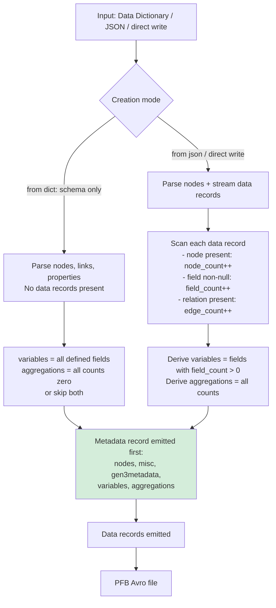

# pypfb Variables & Aggregations — Design Proposal

## Summary

A PFB file today captures a data model and data records, but carries no summary of *which fields actually contain data* or *how many records exist per node*. This matters for data discovery: a consumer receiving a PFB cannot quickly answer "does this file have `age` values?" or "how many `demographic` records are linked to `case` records?" without scanning every row.

This proposal adds two metadata fields to the PFB `Metadata` record — **`variables`** and **`aggregations`** — that are computed at creation time and can be queried instantaneously without reading data rows. Both are already implemented on the `feat/gen3metadata-poc` branch as nullable fields.

---

## 1. Variables

### Purpose

List every `<node>.<field>` pair that has at least one non-null value present in the dataset. Allows a consumer to quickly know what data is populated without scanning records.

### Format

A flat array of dot-notation strings: `"<node>.<field>"`. Using dot notation disambiguates fields that share names across nodes (e.g., `submitter_id` exists on every Gen3 node).

**Avro type (current PoC):** `union<null, array<string>>`

### Example

```json
[
  "case.submitter_id",
  "case.project_id",
  "demographic.age_at_index",
  "demographic.gender",
  "demographic.race",
  "sample.submitter_id",
  "sample.sample_type"
]
```

### Pseudo JSON Schema

```jsonc
// variables: array of "<node>.<field>" strings
{
  "type": "array",
  "items": {
    "type": "string",
    "pattern": "^[a-zA-Z_][a-zA-Z0-9_]*\\.[a-zA-Z_][a-zA-Z0-9_]*$",
    "description": "<node_name>.<field_name> — only fields with ≥1 non-null value"
  },
  "uniqueItems": true
}
```

---

## 2. Aggregations

### Purpose

Provide count-based summary statistics at three granularities:

| Key pattern | Meaning |
|---|---|
| `<node>` | Total number of records for that node type |
| `<node>.<field>` | Count of non-null values for that field across all records |
| `<node>-><related_node>` | Count of edges (relations) between two node types |

The arrow key for edge counts is particularly useful for many-to-one / many-to-many relationships: it tells a consumer how many links exist without walking the full graph.

**Avro type (current PoC):** `union<null, map<union<null, long, double>>>`

The map value is `long` for integer counts and `double` for future ratio/percentage statistics.

### Example

```json
{
  "case": 1250,
  "case.submitter_id": 1250,
  "case.project_id": 1250,
  "demographic": 1248,
  "demographic.age_at_index": 1101,
  "demographic.gender": 1248,
  "demographic.race": 1240,
  "demographic->case": 1248,
  "sample": 4372,
  "sample.submitter_id": 4372,
  "sample.sample_type": 4301,
  "sample->case": 4372
}
```

### Pseudo JSON Schema

```jsonc
// aggregations: flat map with documented key conventions
{
  "type": "object",
  "description": "Keys: '<node>' = record count, '<node>.<field>' = non-null value count, '<node>-><node>' = edge count",
  "additionalProperties": {
    "type": ["null", "integer", "number"]
  },
  "examples": {
    "demographic": 1248,
    "demographic.gender": 1240,
    "demographic->case": 1248
  }
}
```

---

## 3. PFB Creation Flow



**Key design decision:** variables and aggregations require a data scan, which means they are computed *before* writing starts (two-pass) or accumulated during a single streaming pass and written to the header at close time. Avro's write-once header makes the two-pass approach simplest; the writer buffers aggregation state in memory then emits the Metadata record first.

**Skip option:** For schema-only PFBs (e.g., `pfb from dict`) or when the data owner prefers to omit summary stats, a `--skip-variables` / `--skip-aggregations` flag on the creation command leaves these fields `null`.

---

## 4. CLI Surface

### Current PoC (implemented)

```sh
# Read variables from an existing PFB
pfb show variables -i file.pfb
# → ["case.submitter_id", "demographic.gender", ...]

# Read aggregations from an existing PFB
pfb show aggregations -i file.pfb
# → {"case": 1250, "demographic": 1248, ...}
```

### Proposed additions

**Skip during creation:**
```sh
pfb from dict DICTIONARY -o out.pfb --skip-variables --skip-aggregations
pfb from json -o out.pfb --skip-aggregations
```

**Insert / update arbitrary data** (to support external or pre-computed values):
```sh
# Replace variables with content from a JSON file
pfb update variables -i file.pfb -o out.pfb --data variables.json

# Replace aggregations
pfb update aggregations -i file.pfb -o out.pfb --data aggregations.json

# Inline JSON string
pfb update aggregations -i file.pfb -o out.pfb \
  --data '{"case": 500, "demographic": 498}'
```

These `update` commands copy the PFB through a reader→writer pair (using `copy_schema`) and replace only the target metadata field.

---

## 5. Existing Standards

Three standards were reviewed for alignment:

### DDI (Data Documentation Initiative) — *most relevant*

[DDI Lifecycle](https://ddialliance.org/Specification/DDI-Lifecycle/) defines `Variable` elements with rich metadata (concept, representation, question reference) and `SummaryStatistic` with typed measures: `ValidCases`, `InvalidCases`, `Minimum`, `Maximum`, `Mean`, `StandardDeviation`. This is the closest existing standard to the aggregations concept. **Recommendation:** use DDI terminology (`ValidCases` = our field count, `InvalidCases` = null count) as a naming guide if aggregations are expanded beyond simple counts.

### Frictionless Data Packages — *partial alignment for variables*

The [Frictionless Data Package spec](https://specs.frictionlessdata.io/) uses `resources[].schema.fields[]` to describe dataset fields — analogous to our `variables` list. The `stats` section (`{hash, bytes, rows}`) is row-level only with no per-field aggregations. The dot-notation key convention in our aggregations mirrors Frictionless path conventions.

### GA4GH / LinkML — *schema definition, not coverage*

GA4GH Data Connect defines table schemas but has no field-coverage or aggregation concept. LinkML defines slots (analogous to variables) with cardinality constraints but describes what *can* be present, not what *is* present. Neither standard conflicts with this proposal; a future extension could express variables as LinkML slot references.

### VOID (Vocabulary of Interlinked Datasets) — *alignment for edge counts*

[VOID](https://www.w3.org/TR/void/) uses `void:propertyPartition` (triples per property) and `void:classPartition` (triples per class) — a direct semantic analog to our `<node>.<field>` and `<node>` aggregation keys. The `<node>-><related_node>` edge count maps to `void:linkset`.

---

## 6. Open Questions

| Question                                                                                           | Options                                                                                    |
| -------------------------------------------------------------------------------------------------- | ------------------------------------------------------------------------------------------ |
| Should `variables` use dot notation strings (current) or structured objects `{node, field, type}`? | Dot strings are simpler Avro; structured objects are richer but require Avro schema change |
| For `from dict` (schema-only, no data), should variables list all fields or be `null`?             | Listing all fields is useful for discovery; `null` is honest about coverage                |
| Should aggregations include min/max/mean for numeric fields (DDI pattern)? Any other aggregations? | In scope for a future iteration; current `double` value type already supports it           |
| Should `pfb update` copy-through the full file, or support in-place header rewrite?                | Copy-through is safe; in-place would require Avro format knowledge beyond fastavro         |
| Should edge counts distinguish multiplicity (ONE_TO_MANY vs MANY_TO_MANY)?                         | Could use separate key suffixes: `sample->case:MANY_TO_ONE`                                |
